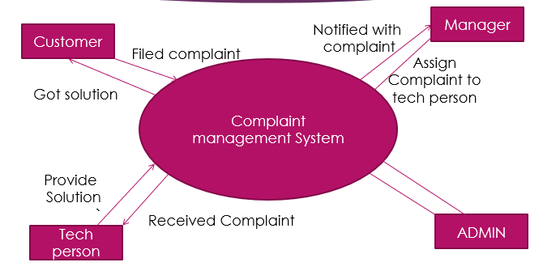

<h1 align='center'>Complaint Management System</h1>
<h4 align='center'>A Project that used to submit customer’s complaints to the authorised company and make an interface between them.</h4>
 

 

A Complaint Management System is a software application which is designed to take online complaints from customers and provide their solutions by some experts. It is the process of how organizations handle, manage, respond to and report customer complaints. 

<h3>How this Project works:</h3>

<h3>Hardware Requirements:</h3>

	Processor 	: Pentium IV or above 
	Memory   	: 1 GB or above recommended for better use 
	Disk Space	: Minimum of 100MB of free space in Hard Disk. 
	Internet connection to access the SMS API portal. 

<h3>Software Requirements:</h3>

	Any Operating system with Python Compatibility. 
	Python version 3.0 or above. 
	MYSQL database. 

Thanks for reading 😊

